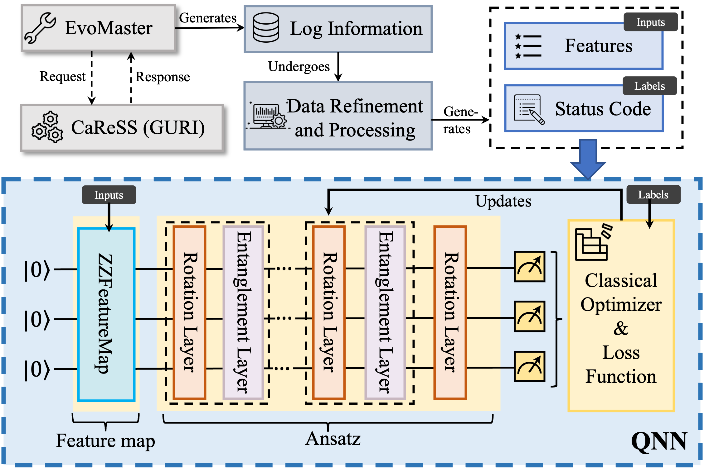

# Quantum Neural Network Classifier for Cancer Registry System Testing: A Feasibility Study

## Abstract
The Cancer Registry of Norway (CRN) is a part of the Norwegian Institute of Public Health (NIPH) and is tasked with producing statistics on cancer among the Norwegian population. For this task, CRN develops, tests, and evolves a software system called Cancer Registration Support System (CaReSS). It is a complex socio-technical software system that interacts with many entities (e.g., hospitals, medical laboratories, and other patient registries) to achieve its task. For cost-effective testing of CaReSS, CRN has employed EvoMaster, an AI-based REST API testing tool combined with an integrated classical machine learning model. Within this context, we propose Qlinical to investigate the feasibility of using, inside EvoMaster, a Quantum Neural Network (QNN) classifier, i.e., a quantum machine learning model, instead of the existing classical machine learning model. Results indicate that Qlinical can achieve performance comparable to that of EvoClass. We further explore the effects of various QNN configurations on performance and offer recommendations for optimal QNN settings for future QNN developers.

## Overview


## Installation of running the code
This repository contains code for running QNN and EvoClass.

We use [Qiskit](https://qiskit.org/) as a quantum framework for QNN

The following steps should guarantee to have a working installation:
* Install Anaconda. You can download Anaconda for your OS from [https://www.anaconda.com/](https://www.anaconda.com/)
* Create an environment (e.g., with name "quantum_env")
    * conda create -n quantum_env python=3.10
* Activate the environment, and install qiskit, qiskit_machine_learning, sklearn, matplotlib
    * conda activate quantum_env
    * pip install qiskit
    * pip install qiskit-machine-learning
    * pip install skearn
    * pip matplotlib

## Running our code

The approach can be run as follows.

First, you need to activate the conda environment:

```
conda activate quantum_env
```

In order to run Qlinical, you can use the following command line:
```
python qnn_classifier.py [ansatz] [entangl] [mode] [num_rep] [run] [num_feat]
```
Ansatz types: "realamplitudes", "efficientsu2", "excitationpreserving", "paulitwodesign"

Entanglement types: "full", "linear", "reverse_linear", "pairwise", "circular", "sca"

Mode: for excitationpreserving, 0 represents "fsim"; 1 represents "iswap"

Num_rep: 1,3,5,7

Num_feat: 4,5,6,7,8

Run: The number of repeats of the experiment

In order to run EvoClass, you can use the following command line:
```
python evoclass.py
```
